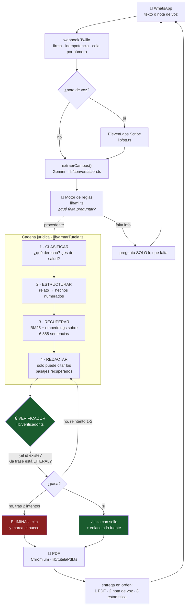

# Mijo

**Le cuentas por WhatsApp que tu EPS te negó algo —escrito o en nota de voz— y te devuelve tu acción de tutela en PDF, lista para radicar, con sentencias de la Corte Constitucional citadas y verificadas una por una.**

<!-- TODO equipo: GIF de 10 s del producto (nota de voz entra → PDF sale).
     Grabar con: /api/dev/tutela-demo para el PDF, y el chat real para WhatsApp. -->


## 🎥 Video de 1 minuto

<!-- TODO equipo: pegar el link -->
**[Ver la demo (1:00)](https://ejemplo.com/video)**

---

## Arquitectura



**La regla que ordena todo el diseño: el modelo emite juicios, el código emite hechos.**
Qué derecho se vulneró, en qué orden pasaron las cosas y qué sentencia se parece al caso son juicios, y ahí el LLM es irremplazable. Si una cita existe, o si una fecha la dijo la persona, no son juicios: son cadenas que se pueden buscar. Eso no se le pregunta a un modelo.

---

## Dónde está la IA

Modelo: **Gemini 2.5 Flash** (`gemini-2.5-flash`) para todo lo generativo, **gemini-embedding-001** (768d) para la analogía jurídica, **ElevenLabs Scribe** para voz→texto y **ElevenLabs TTS** con acentos regionales colombianos para texto→voz.

| # | Qué decide | Archivo | Si falla |
|---|---|---|---|
| 1 | **Clasificar** — qué derecho fundamental está en juego, si el caso es de salud, si hay riesgo que amerite medida provisional | [`lib/prompts/clasificar.ts`](web/lib/prompts/clasificar.ts) | Se asume salud y se sigue: el flujo entero ya está acotado a negativas de EPS |
| 2 | **Estructurar** — convierte el desahogo en hechos numerados en orden cronológico procesal. Es reescritura con criterio jurídico, no formateo | [`lib/prompts/estructurar.ts`](web/lib/prompts/estructurar.ts) | **Único paso sin el que no hay documento.** Se avisa y se pide reintentar |
| 3 | **Redactar** — los fundamentos de derecho, citando *solo* los pasajes recuperados | [`lib/prompts/redactar.ts`](web/lib/prompts/redactar.ts) | El escrito sale con los fundamentos de ley y sin citas. Sigue siendo radicable: el art. 14 del Decreto 2591 dice que no es indispensable citar la norma infringida |
| — | **Conversar** — extrae varios campos por turno y responde dudas de paso | [`lib/conversacion.ts`](web/lib/conversacion.ts) | Cae a reglas y regex; el bot sigue andando con lenguaje menos flexible |
| — | **Recuperar** — encuentra la sentencia cuyo *supuesto de hecho* se parece | [`lib/jurisprudencia.ts`](web/lib/jurisprudencia.ts) | Sin embeddings queda solo BM25; con menos analogía pero funciona |

### Lo que NO decide el modelo

- **Si una cita es real** → [`lib/verificador.ts`](web/lib/verificador.ts)
- **Si una fecha la dijo la persona** → `fechaSoloSiLaDijo()` en [`lib/prompts/estructurar.ts`](web/lib/prompts/estructurar.ts)
- **Si la tutela es procedente** → motor de reglas en [`lib/ml.ts`](web/lib/ml.ts), con el fundamento normativo de cada requisito
- **La estadística de casos análogos** → se cuenta sobre el corpus, no se estima

### Sobre el "cerebro": reglas, no un modelo entrenado

`lib/ml.ts` era el cliente de un microservicio Python con LightGBM. Ahora es un motor de reglas en TypeScript, con la misma superficie pública. **La procedencia de una tutela no es una predicción: es una lista de requisitos que la Constitución y el Decreto 2591 de 1991 fijan por escrito.** Un modelo aprendido daría una probabilidad que nadie puede auditar, y en un producto jurídico eso sería peor que inútil. El motor dice qué requisito falta y en qué norma está, y eso se puede discutir con un juez.

Por eso el campo `explicacion_shap` ya no trae valores SHAP sino la lista de reglas evaluadas con su fundamento. Para un producto jurídico es estrictamente mejor: es auditable.

---

## Cómo garantizamos que no alucina

Un asistente jurídico se cae siempre en el mismo punto: inventa *"T-855 de 2019"* con una frase que suena a Corte Constitucional y que nadie escribió jamás. La defensa es de dos capas.

**Capa 1 — el modelo no conoce el corpus.** Solo ve los pasajes recuperados, y debe entregar cada cita partida en dos campos (`sentencia` + `frase`) en vez de incrustarla en la prosa. Eso convierte la verificación en una comparación de cadenas, no en un problema de parseo.

**Capa 2 — el verificador, que asume que la capa 1 va a fallar.** Sobre cada cita:

1. ¿Se puede leer el id? Cubre `T-760/08`, `T-760-08`, `T-760 de 2008`, `T-760/2008`, `SU-480/97`, `C-313 de 2014`…
2. **¿El id existe en el corpus?** Si no → la sentencia es inventada → se rechaza.
3. **¿La frase está LITERAL en esa sentencia?** Se normaliza lo que cambia al copiar (mayúsculas, tildes, comillas curvas, las tres clases de guion, notas al pie del corpus) y nada más. Si no coincide → se rechaza.
4. Si algo falla → se le pide al modelo que rehaga, diciéndole exactamente qué falló. Máximo 2 intentos.
5. Si sigue fallando → **se ELIMINA la cita** y el fundamento queda marcado como hueco.

El paso 3 es el que de verdad importa. Una sentencia inventada la caza cualquiera. Una sentencia **real** con una frase retocada —una negación que desaparece, un "podrá" que se vuelve "deberá"— pasa todos los filtros humanos y es la que hunde el caso.

> Preferimos una tutela con una cita menos que una con una cita falsa. La primera es más débil; la segunda le explota en la cara a la persona frente al juez.

Cada cita que sobrevive lleva en el PDF su sello y el enlace a la fuente oficial.

### Resultados del eval

<!-- EVAL:INICIO — generado por: node eval/correr.mjs · 10 casos -->

| Métrica | Resultado |
|---|---|
| Casos evaluados | 10 (10 con etiqueta humana) |
| Acierta si el caso es de su alcance (`es_tutelable`) | **100%** (10/10) |
| Acierta el derecho vulnerado exacto | 40% (4/10) |
| Acierta la medida provisional | 30% (3/10) |
| Citas que el modelo propuso | 45 (en 7 casos redactados) |
| **Citas rechazadas por el verificador** | **8,9%** (4/45) |
| Citas que llegaron al documento | 41 |

**Todos los rechazos fueron `frase_no_literal`**: sentencias que existen, puestas a decir algo que no dicen. Ninguna cita con id inventado sobrevivió a la redacción, pero la alteración de texto sí aparece de forma constante. Un ejemplo real de esta corrida, en T-125/98: el modelo tomó una lista textual de procedimientos cubiertos y **sustituyó los items por los que le convenían al caso** ("quimoterapia y radioterapia para el cáncer" donde la sentencia dice "transporte renal, diálisis, neurocirugía"). Se lee perfecto, cita una sentencia real, y es falso.

**Casi 1 de cada 11 citas propuestas habría llegado a un juzgado como cita falsa.** Eso es lo que mide este número.

> El propio eval encontró un bug **en el verificador**, no en el modelo. La primera corrida daba 35,1% de rechazo. Investigando caso por caso resultó que `normalizarTexto()` sustituía las notas al pie del corpus por un espacio, así que `condiciones[14].` quedaba como `condiciones .` y no coincidía con el `condiciones.` que escribe el modelo. Un carácter. Se estaba **descartando una de cada tres citas buenas**. Corregido y con test de regresión; la cifra real es 8,9%. Se deja escrito porque es la clase de error que un eval existe para encontrar.

**Sobre el 40% del derecho exacto — lo que ese número no dice.** Casi todos los desacuerdos son de taxonomía, no errores: en el caso de la cita de neurología que nunca llega, la etiqueta humana dice `salud` y el modelo dice `diagnóstico` (que es un derecho autónomo reconocido por la Corte justo para ese supuesto); en el del oxígeno domiciliario, `salud` contra `vida`. En varios el modelo tiene mejor argumento que la etiqueta. **La decisión que de verdad gobierna el producto —si el caso es de su alcance— va en 100%**, incluidos los casos de pensiones, arriendo y laboral que se metieron a propósito para ver si sabe decir "esto no es lo mío". El derecho concreto, además, no cambia el documento: los fundamentos se construyen sobre los hechos y la ley.
<!-- EVAL:FIN -->

Los 10 casos semilla están en [`eval/casos.json`](eval/casos.json) con la estructura para los 50; incluyen casos **fuera de alcance** a propósito (pensiones, arriendo, laboral), porque si el clasificador no sabe decir "esto no es lo mío", el producto arma tutelas que no sirven.

La tasa de rechazo no mide si el modelo es bueno: **mide cuántas citas falsas habrían llegado a un juzgado si el verificador no existiera.**

Además, 8 tests del verificador sin dependencias (`cd web && npm test`): cita válida, id inexistente, texto alterado, variantes de formato de id, frase demasiado corta, nota al pie del corpus, y eliminación tras agotar los 2 reintentos.

---

## El corpus

23.750 sentencias de la Corte Constitucional (1992-2021) del dataset [`Manuel/sentencias-corte-cons-colombia-1992-2021`](https://huggingface.co/datasets/Manuel/sentencias-corte-cons-colombia-1992-2021) (CC-BY-4.0). **No se scrapea corteconstitucional.gov.co: su robots.txt lo prohíbe**; el sitio solo se usa para construir el enlace de la fuente.

| | |
|---|---|
| Sentencias filtradas a salud | **6.888** de 23.750 |
| Chunks indexados | 20.481 |
| Con embedding | 6.888 (100%) |
| Etiqueta de resultado | 5.188 concedidas · 391 negadas · 1.309 indeterminadas |
| Tamaño del índice | 28 MB (gzip, embeddings en int8) |

La etiqueta de resultado sale de la parte resolutiva con regex, y sirve para dos cosas: priorizar citas de sentencias **concedidas** y calcular la estadística que se le manda a la persona.

**Sin base vectorial, a propósito.** Son unos miles de vectores de 768 dimensiones en int8: el producto punto de todo el corpus contra la consulta es un recorrido lineal sobre un `Int8Array` contiguo —milisegundos— y evita operar, versionar y pagar un servicio aparte. Con este tamaño de corpus, un índice ANN sería más infraestructura para el mismo resultado.

Los dos recuperadores se fusionan con **RRF** (Reciprocal Rank Fusion) y no con una suma ponderada, porque BM25 no está acotado y el coseno va de -1 a 1: normalizarlos exigiría calibrar un peso a mano. RRF solo mira el orden.

---

## Instalación

```bash
git clone <este-repo> && cd mijo/web && npm install && npx playwright install chromium
cp ../.env.example .env.local   # y poner GEMINI_API_KEY, TWILIO_*, ELEVENLABS_API_KEY
npm run dev                     # el índice de jurisprudencia ya viene en el repo
```

Ver el PDF sin pasar por WhatsApp: **`/api/dev/tutela-demo`**.

### Supabase (opcional, recomendado para la demo)

Sin Supabase todo funciona: los casos viven en memoria, y la nota de voz y el PDF se sirven desde el proceso local a través de ngrok. El problema es que **Twilio tiene que descargar esos archivos**, y ngrok en plan free es lento y se cae — justo con el PDF, que es el entregable.

Con Supabase, el audio y el PDF salen de un bucket público con URL estable.

```bash
# 1. En el dashboard → SQL Editor, correr en orden:
#    web/supabase/migrations/0001_init.sql   (tablas)
#    web/supabase/migrations/0002_storage.sql            (bucket audios)
#    web/supabase/migrations/0007_storage_documentos.sql (bucket documentos)
# 2. Pegar las llaves en .env.local y activar:
node scripts/activar-supabase.mjs
```

El script **comprueba antes de activar** y se niega si falta una tabla o un bucket. No es celo: `createLead()` lanza excepción si el insert falla, así que unas llaves puestas sin las tablas rompen el bot en el primer mensaje. Media conexión es peor que ninguna. `--revisar` diagnostica sin tocar nada; `--apagar` vuelve a modo local.

Para regenerar el corpus desde cero (descarga 1,6 GB, ~25 min):

```bash
node scripts/indexar-sentencias.mjs
```

---

## Despliegue

### Antes de abrir el túnel

```bash
# en web/.env.local
WHATSAPP_VERIFY_SIGNATURE=true
```

La firma de Twilio solo se exige sola en producción. Con ngrok el proceso sigue
siendo "desarrollo" pero **ya está expuesto a internet**: sin esa variable,
cualquiera que dé con la URL puede forjar mensajes entrantes y gastar la cuota de
Gemini y ElevenLabs. Verificado en ambos sentidos: firma legítima → 200, forjada
→ 403.

**Corre en local con ngrok, y es a propósito.** El sandbox de WhatsApp de Twilio solo entrega mensajes a números que hicieron `join`, así que una URL pública no aporta nada para la demo: el cuello de botella es el sandbox, no el hosting.

La ruta a producción es WhatsApp Business API con número propio, y despliegue en **un proceso Node persistente** (Railway, Render, Fly). **No serverless**, por dos razones concretas de este código: el estado de la sesión vive en memoria (`globalThis`), y la entrega es asíncrona *después* de responder el webhook — una función que se congela al devolver la respuesta cortaría el envío del PDF y de la nota de voz a la mitad.

---

## Radicación

Mijo no solo arma la tutela: la puede **radicar por correo** ante la Oficina Judicial de Reparto de la ciudad de la persona. Radicar por medio electrónico es una vía legal plena desde la **Ley 2213 de 2022**, que volvió permanente la justicia digital.

**El código de radicación está completo y es el que iría a producción.** No es una simulación ni un mock.

### Por qué en la demo no llega a un juzgado

`REPARTO_OVERRIDE_EMAIL` redirige todos los envíos a un buzón de pruebas del equipo.

**El motivo no es técnico.** Una tutela de prueba que llega a una Oficina de Reparto ocupa un turno y consume el tiempo de un juez que le corresponde a una persona con un caso real — alguien enfermo, esperando que le autoricen un tratamiento. Un producto que existe para destrabar el acceso a la justicia no puede empezar congestionándola.

El destinatario real **se calcula igual, se registra igual y se muestra dentro del correo**:

```
[reparto] real=ofjudmed@cendoj.ramajudicial.gov.co usado=equipo@ejemplo.com override=sí
```

**El único cambio para producción es quitar esa variable de entorno.** Nada más.

### La radicación exige consentimiento explícito

Después de recibir el PDF, el bot pregunta aparte:

> *"¿Quieres que la radique por ti ante la Oficina Judicial de Reparto de Medellín?"*

Solo con un **sí** en ese momento se envía. No basta con que la persona haya pedido la tutela: radicar abre un proceso, fija términos y la deja notificada. Eso se autoriza, no se asume. El "no" es una respuesta igual de válida y el documento sigue siendo suyo.

### El mapa de oficinas

[`web/data/reparto.json`](web/data/reparto.json) cubre 10 ciudades. **8 de 10 verificadas** contra el [listado oficial de correos institucionales del CENDOJ](https://www.ramajudicial.gov.co/documents/2302615/32812435/); Bogotá y Barranquilla quedan en `verificado: false` porque el listado oficial solo trae para ellas las oficinas de *Depósitos Judiciales* y *Títulos*, que **no son las de reparto**. Al usar una sin verificar, el código lo advierte en el log y el correo lo dice.

Si la ciudad no está en el mapa, no se inventa nada: se le da a la persona el enlace del [portal de Tutela en Línea](https://procesojudicial.ramajudicial.gov.co/TutelaEnLinea), que funciona para todo el país.

### Probarlo sin levantar el bot

```bash
cd web && node scripts/probar-correo.mjs --sin-enviar   # solo resuelve y muestra
cd web && node scripts/probar-correo.mjs                # envía a los overrides
```

El script **se niega a correr** si `REPARTO_OVERRIDE_EMAIL` no está definida.

---

## Llamada: dos modos

Todo el producto entrega por WhatsApp, y eso **excluye justo al usuario que más lo necesita**: la persona mayor con un teléfono básico, sin datos, que lleva ocho meses peleando con la EPS. Pedirle WhatsApp es pedirle exactamente lo que no tiene.

### Modo 1 · Mijo lee la tutela (un solo sentido)

La persona escribe `llámame` y el bot llama y le lee el documento. **No necesita webhook ni ngrok**: el TwiML va incrustado en el POST y lo único que Twilio debe alcanzar es el MP3, que ya vive en Supabase Storage.

### Modo 2 · Mijo conversa y arma la tutela por teléfono

La llamada como canal completo: Mijo pregunta, la persona responde hablando, y al final **el PDF va por correo** — no por WhatsApp, porque quien llamó probablemente no lo tiene.

Twilio hace POST a `/api/voz/twiml` en cada turno con lo que la persona dijo (`<Gather input="speech" language="es-CO" speechModel="phone_call" speechTimeout="auto">`). Esto **sí** necesita URL pública.

Lo que cambia respecto del chat, y no es cosmético — **todo esto salió de llamadas reales, no de suponer**:

- **La cédula se marca en el teclado.** Dictar diez dígitos es pedirle a Twilio que adivine; con DTMF no hay reconocimiento que falle. Se aceptan las dos (`input="dtmf speech"`), y gana el teclado.
- **`speechTimeout="auto"` es un error al deletrear.** Quien deletrea hace pausas entre letra y letra y Twilio las lee como fin de frase: el bot interrumpía con «no le entendí el correo» a mitad del deletreo. En ese turno el timeout es fijo y largo, y se cierra con la tecla numeral.
- **El cierre NO espera al documento.** Twilio corta la llamada si el webhook no responde en ~15 s, y armar la tutela toma 40-60 (tres llamadas a Gemini, embeddings, verificación y Chromium). Esperarla dentro del turno hacía que la llamada muriera **siempre**, justo al final, después de que la persona ya había contado todo — el peor momento posible para colgarle a alguien. Ahora se despide, cuelga, y el documento se arma en segundo plano y sale por correo. Mismo patrón que `entregarAsync()` en WhatsApp.
- **Las preguntas se sintetizan una sola vez.** Son ocho frases fijas; volver a generarlas en cada llamada era pagar 2-4 s con el reloj de Twilio corriendo. Con caché, el saludo pasó de 4.235 ms a 1.135 ms.
- **La extracción tiene reloj.** Si Gemini se pasa de 6 s se sigue con la extracción por reglas: antes que una perfecta que llega tarde, sirve más una a tiempo — con la llamada ya cortada no sirve ninguna.
- **Los ordinales se traducen.** «El primero de junio» no lo entiende ningún extractor de fechas —espera un número— y es exactamente como se dice el día en castellano. `normalizarOrdinales()` lo convierte antes de que el texto llegue al modelo.

- **Una pregunta por turno.** Por teléfono no se puede releer: un mensaje escrito mete tres datos en una frase porque el ojo vuelve, y al oído eso se pierde entero.
- **El correo se confirma deletreándolo de vuelta.** Es el dato que el reconocimiento de voz destroza y el único sin el cual no hay entrega. `correoDeVoz()` traduce lo dictado — *"juan punto perez arroba gmail punto com"* → `juan.perez@gmail.com` — en código, no con un modelo: es una transliteración fija y equivocarse manda el documento a la nada.
- **`limpiarParaVoz()`** quita emojis, `*negritas*` y URLs antes del TTS. Sin eso la voz lee "asterisco" y deletrea la URL entera.
- **Contestadora detectada** (`AnsweredBy=machine`) → cuelga sin dejarle el discurso al buzón.
- El `catch` **nunca deja la llamada en silencio**: se despide y cuelga.

```bash
# conversar (necesita la URL de ngrok)
curl "http://localhost:3000/api/dev/llamada-asesor?to=%2B57...&base=https://xxx.ngrok-free.app"
# solo leer un documento ya armado
curl "http://localhost:3000/api/dev/llamada-demo?to=%2B57..."
```

**Ninguno de los dos afecta a WhatsApp:** otro número (`TWILIO_VOICE_FROM`), otra API, y una llamada no gasta un mensaje del sandbox.

> En cuenta **trial** solo se puede llamar a números verificados (Phone Numbers → Verified Caller IDs).

<details>
<summary>Nota sobre la procedencia de este canal</summary>

La máquina de turnos de voz viene del proyecto propio anterior y se conservó porque estaba bien resuelta —detección de contestadora, `speechTimeout="auto"`, reintento sin sonar a disco rayado. El cerebro es nuevo: [`lib/voz/mijo.ts`](web/lib/voz/mijo.ts).
</details>

---

## Seguimiento y desacato

El juez falla en 10 días hábiles (art. 29). **Y si concede la tutela pero la EPS no cumple, ahí es donde la mayoría de la gente se queda varada:** ganó, y no pasa nada. El artículo 52 del Decreto 2591 de 1991 le da un **incidente de desacato** que es gratis, va ante el *mismo* juez y puede terminar en arresto de hasta 6 meses y multa para el representante legal. Casi nadie lo sabe.

Un bot de WhatsApp puede hacer algo que un abogado no hace: **acordarse**. Al radicar se agenda el seguimiento a 10 días hábiles y llegado el día pregunta qué pasó. Según lo que la persona conteste:

| Respuesta | Qué explica |
|---|---|
| *"me la concedieron pero no han cumplido"* | El incidente de desacato: mismo juez, gratis, sanción personal al representante legal |
| *"no me han respondido"* | Cómo pedir informe del estado al despacho y la queja ante el Consejo Seccional |
| *"me la negaron"* | La impugnación: **3 días**, escrito corto, mismo juzgado |
| *"ya me lo dieron"* | Que guarde el fallo — si reincide, el camino ya es el desacato, más rápido |

La lectura de la respuesta va **por reglas, no por LLM**: son cuatro desenlaces con vocabulario muy estable, y equivocarse manda a alguien a un desacato cuando lo que necesita es una impugnación, que tiene 3 días y se le vence. 10/10 en las frases de prueba.

### Dispararlo

```bash
curl -X POST https://<host>/api/seguimiento -H "Authorization: Bearer $SEGUIMIENTO_TOKEN"
```

Va protegida con token porque **escribe a la gente**: sin él, cualquiera con la URL spamea a todos los usuarios. Sin `SEGUIMIENTO_TOKEN` configurado responde 503 y no hace nada — una ruta que manda mensajes no puede quedar abierta por olvido. No hay temporizador interno a propósito: un `setInterval` en un proceso que se reinicia se pierde en silencio y nadie se entera de que los recordatorios dejaron de salir.

### Para la demo

Un recordatorio a 10 días hábiles es imposible de mostrar en un video de un minuto. Escribile al bot:

```
simular seguimiento
```

y dispara el aviso de inmediato sobre lo último que radicaste.

---

## Limitaciones honestas

- **Solo tutelas de salud** contra EPS o entidades de salud. Pensiones, laboral, educación o vivienda salen por `es_tutelable: false`. Es una decisión de alcance, no un descuido.
- **El corpus llega hasta 2021.** Jurisprudencia posterior no existe para el sistema. No es grave —el precedente en salud está consolidado y T-760/08 sigue siendo la piedra angular— pero hay que decirlo.
- **1.309 sentencias quedaron con resultado `indeterminada`** (19%). Sale de casos donde la parte resolutiva confirma o revoca el fallo de instancia sin un verbo de decisión propio. Quedan fuera del denominador de la estadística en vez de contarse mal.
- **El estado vive en memoria.** Si se reinicia el proceso, las conversaciones a medias se pierden.
- **Armar la tutela tarda 40-60 s** (3 llamadas a Gemini + embedding + Chromium). Se avisa por WhatsApp antes de empezar para que el silencio no se lea como que el bot se colgó.
- **Nadie revisa el documento antes de que salga.** Mijo no reemplaza a un abogado y el PDF lo dice: la persona debe leerlo y corregir lo que no esté bien antes de radicar.
- **La estadística no es una predicción.** Es lo que la Corte ya decidió en casos con hechos parecidos, y así se le presenta a la persona, explícitamente.

## Roadmap

1. **Radicación asistida** — hoy la persona imprime y camina hasta el juzgado. Varios despachos reciben por correo; el siguiente paso natural es generar el correo con el PDF adjunto y la dirección del juzgado competente por ciudad.
2. **Seguimiento del fallo** — recordar a los 10 días y guiar la impugnación (3 días de plazo), que es donde más gente se queda por no saber.
3. **Incidente de desacato** — la tutela ganada que la EPS no cumple es un problema tan grande como la negativa original, y el trámite es aún menos conocido.
4. **Ampliar el alcance** a pensiones y educación, que son el segundo y tercer motivo de tutela en Colombia.
5. **Corpus al día** con las sentencias posteriores a 2021.

---

## Sobre la base de código

La infraestructura de WhatsApp —STT, TTS con acentos regionales, webhook con validación de firma de Twilio, idempotencia, cola por número, debounce de ráfaga, entrega asíncrona con orden de media garantizado, y el render headless a PDF— **viene de un proyecto propio anterior** ([commit base](../../commit/57764db)) y se reutilizó tal cual. De `app/api/whatsapp/route.ts` solo se reescribió `computarRespuesta()`, más 8 líneas insertadas al principio de `entregarAsync()` para mandar el PDF primero.

Lo construido para Mijo es el indexador del corpus, el retrieval de jurisprudencia, el motor de reglas de procedencia, los tres prompts, **el verificador de citas**, la plantilla del documento y el flujo de conversación.

---

<sub>Corpus: dataset de sentencias de la Corte Constitucional bajo CC-BY-4.0. Mijo no presta servicios de abogacía; genera un borrador que la persona revisa, firma y radica por sí misma, como la ley expresamente le permite (Decreto 2591 de 1991, art. 10).</sub>
